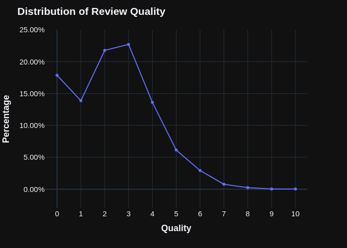
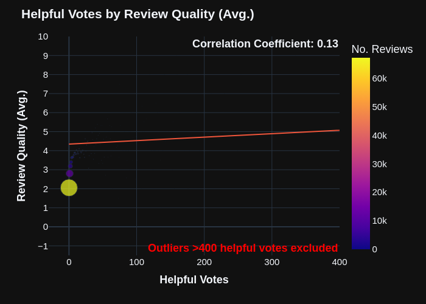
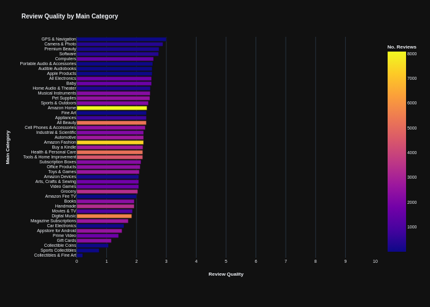

# One Star Reviews

Should you trust negative reviews more than positive ones? Some people think
[one-star reviews](https://near.blog/read-the-one-star-reviews/) are more
valuable, arguing that the frustration of a defective product motivates more
detailed feedback than satisfaction with a good one. But is this actually true?
This project uses machine learning and statistical analysis to investigate this
question empirically.

# The Process

The analysis pipeline consisted of four main stages:

1. **Data Collection**: Used the
   [2023 Amazon Reviews Dataset](https://amazon-reviews-2023.github.io/)
   containing ~250GB (uncompressed) of review and product data.

2. **Data Processing:** Developed two separate data processing pipelines
   tailored to the environment:

   - **Apache Spark:** Built a distributed pipeline as part of a learning
     initiative to understand its scalability for handling large datasets, even
     though the setup was on a single machine.
   - **Polars:** Created a separate single-node pipeline to optimize performance
     for local processing, significantly reducing runtime for the same tasks.

3. **Review Quality Assessment**:

   - Manually labeled 1,020 reviews (102 sets of 10) to create training data
   - Evaluated reviews on three criteria:

     - Information detail and usefulness
     - Objectivity and lack of emotional bias
     - Product-specific relevance

   - Fine-tuned Gemini 1.5 Flash on this labeled dataset
   - Validated model outputs through manual inspection of score distributions
     and edge cases

4. **Statistical Analysis**: Analyzed relationships between review quality and
   various factors using a sample of 40k+ reviews.

# Key Findings

## Review Quality Distribution

The first striking observation was that high-quality reviews are rare. Our
analysis shows that approximately 90% of reviews score below 5/10 on our quality
metric.

Common low-quality patterns include:

- Single-line reactions ("Great product!!")
- Non-informative statements ("As expected")
- Pre-purchase comments ("Just ordered, can't wait!")

This is largely due to the brief nature of reviews. Character count strongly
correlates with review quality, yet the average review contains just 221
characters (roughly 44 words):

There are diminishing returns, however. Examining the plot, we can observe that
the benefits of review length begin to plateau after about 1000 characters (~200
words).

## Main Hypothesis Results

Our analysis confirms that negative reviews tend to be higher quality, but with
some nuances:

Key findings:

- Weak-to-moderate negative correlation ($r = -0.27$) between star rating and
  review quality
- 2-star reviews actually scored higher than 1-star reviews
- 3-star reviews nearly matched 1-star reviews in quality

The data suggests reading all reviews ≤3 stars rather than just 1-star reviews.

### Price Impact

Higher-priced items received better quality reviews:

This suggest that greater financial investment may motivate more thorough
reviewing.

# Surprising Findings

## Verified Purchase Status

Unexpectedly, non-verified purchase reviews scored higher in quality
($r = -0.22$):

This could indicate review manipulation, with companies potentially gaming the
verified purchase system for positive reviews.

## Helpful Votes

Another suprising finding was the lack of correlation between helpful votes and
review quality:

This unexpected finding is likely due to issues with sample size. The vast
majority of reviews receive 0 helpful votes, which becomes clear when the plot
is adjusted to reflect sample size as scatter point size:

You can barely see most of the points above ~50 helpful votes!

### Regression

Inputting all of the above variables into a regression model, we observe that
character count, rating, verified purchase status, price, and helpful votes
explain about a third of the variance in review quality (32.8%). This is
relatively low, which suggests that you shouldn't discard reviews just because
they are short, low in price, or high in rating – there are various other
factors not included in this model that predict review quality to a significant
degree.

   
<b>Full Results</b>

    
<table>
    <caption>OLS Regression Results</caption>
    <tr>
        <th>Dep. Variable:</th>
        <td>Review Quality</td>
        <th>R-squared:</th>
        <td>0.420</td>
    </tr>
    <tr>
        <th>Model:</th>
        <td>OLS</td>
        <th>Adj. R-squared:</th>
        <td>0.420</td>
    </tr>
    <tr>
        <th>Method:</th>
        <td>Least Squares</td>
        <th>F-statistic:</th>
        <td>8190.</td>
    </tr>
    <tr>
        <th>Prob (F-statistic):</th>
        <td>0.00</td>
        <th>Log-Likelihood:</th>
        <td>-93814.</td>
    </tr>
    <tr>
        <th>No. Observations:</th>
        <td>56511</td>
        <th>AIC:</th>
        <td>1.876e+05</td>
    </tr>
    <tr>
        <th>Df Residuals:</th>
        <td>56505</td>
        <th>BIC:</th>
        <td>1.877e+05</td>
    </tr>
    <tr>
        <th>Df Model:</th>
        <td>5</td>
        <th></th>
        <td></td>
    </tr>
    <tr>
        <th>Covariance Type:</th>
        <td>nonrobust</td>
        <th></th>
        <td></td>
    </tr>
</table>
<table>
    <tr>
        <td></td>
        <th>coef</th>
        <th>std err</th>
        <th>t</th>
        <th>P>|t|</th>
        <th>[0.025</th>
        <th>0.975]</th>
    </tr>
    <tr>
        <th>const</th>
        <td>3.6575</td>
        <td>0.027</td>
        <td>134.910</td>
        <td>0.000</td>
        <td>3.604</td>
        <td>3.711</td>
    </tr>
    <tr>
        <th>Length</th>
        <td>0.0023</td>
        <td>1.49e-05</td>
        <td>155.178</td>
        <td>0.000</td>
        <td>0.002</td>
        <td>0.002</td>
    </tr>
    <tr>
        <th>Rating</th>
        <td>-0.3807</td>
        <td>0.004</td>
        <td>-84.746</td>
        <td>0.000</td>
        <td>-0.389</td>
        <td>-0.372</td>
    </tr>
    <tr>
        <th>Verified Purchase</th>
        <td>-0.2306</td>
        <td>0.018</td>
        <td>-12.483</td>
        <td>0.000</td>
        <td>-0.267</td>
        <td>-0.194</td>
    </tr>
    <tr>
        <th>Price</th>
        <td>0.0013</td>
        <td>6.97e-05</td>
        <td>18.083</td>
        <td>0.000</td>
        <td>0.001</td>
        <td>0.001</td>
    </tr>
    <tr>
        <th>Helpful Votes</th>
        <td>0.0010</td>
        <td>0.001</td>
        <td>1.844</td>
        <td>0.065</td>
        <td>-6.47e-05</td>
        <td>0.002</td>
    </tr>
</table>
<table>
    <tr>
        <th>Omnibus:</th>
        <td>10672.901</td>
        <th>Durbin-Watson:</th>
        <td>1.947</td>
    </tr>
    <tr>
        <th>Prob(Omnibus):</th>
        <td>0.000</td>
        <th>Jarque-Bera (JB):</th>
        <td>103098.649</td>
    </tr>
    <tr>
        <th>Skew:</th>
        <td>-0.631</td>
        <th>Prob(JB):</th>
        <td>0.00</td>
    </tr>
    <tr>
        <th>Kurtosis:</th>
        <td>9.496</td>
        <th>Cond. No.</th>
        <td>2.55e+03</td>
    </tr>
</table>

## Other Insights

### Category

Another interesting finding to consider is the effect of review category:

For categories with a decent sample size, the "Gift Card" section seems to be
the worst, and the "Computers" section seems to be the best!

The "Gift Cards" placement makes sense: what can you really say about a Gift
Card, other than "It works"?

The "Computers" placement is partially explained by price, where "Computers" has
the 6th highest average. Additionally, computers can be evaluated across
multiple objective dimensions (performance, noise, price), in contrast to gift
cards that only really have one dimension (did it work?)

# Practical Recommendations

When reading Amazon reviews, our analysis suggests:

1. **Sort by "Top reviews"** rather than "Most recent"
   - The "helpful votes" correlation suggests this surfaces better content
2. **Include non-verified purchase reviews**
   - Don't limit yourself to verified purchases, as they don't correlate with
     higher quality
3. **Focus on ≤3 star reviews**
   - These consistently contain more detailed, objective information
4. **Consider product price context**
   - Expect more detailed reviews on higher-priced items
5. **Use format filters selectively**
   - While not directly analyzed, these can help focus on relevant variations of
     products

# Future Work

Planned improvements include:

- Analysis of review quality variations across product categories
- Investigation of seasonal review quality patterns
- Expansion of the training dataset to improve model calibration

# Technical Details

The complete codebase and detailed technical documentation are available in the
repository. Key implementation notes:

- Review quality model training code and evaluation criteria
- Data processing pipelines for both Spark and Polars
- Statistical analysis script and SQL queries
- Visualization generation scripts
