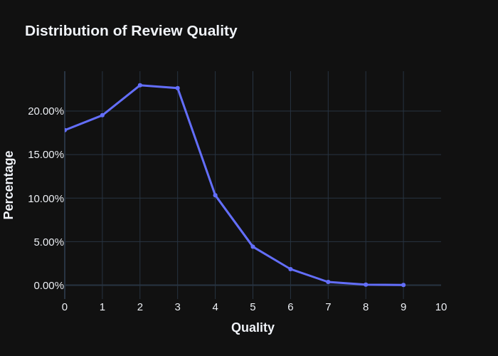
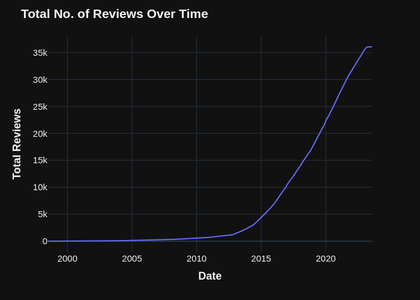
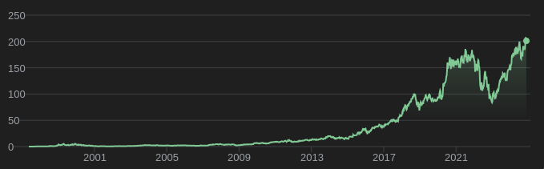
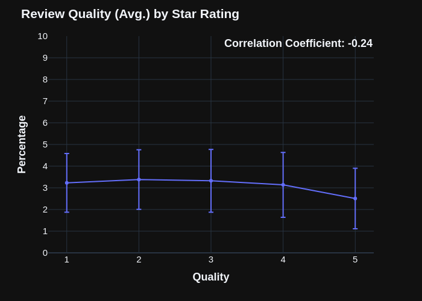
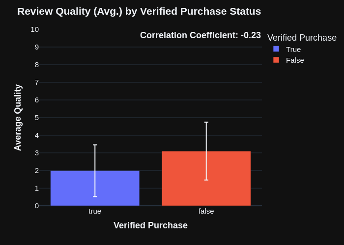
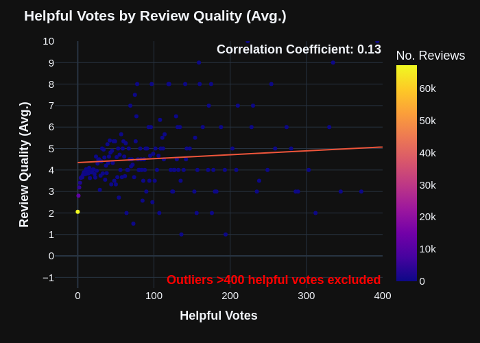
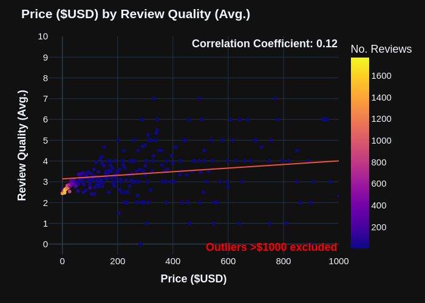

# One Star Reviews

Are more negative product reviews generally higher quality?
[Some people](https://near.blog/read-the-one-star-reviews/) think so, to such a
degree that they advise people to only read the 1\* reviews! This seems to make
sense – the anger you experience from getting a defective product typically
outweighs the satisfaction you get from a great deal. But is this _really_ true?
Should you read the one star reviews? That's what this project will investigate.

# The Process

The general process was as follows:

1. **Find some review data:** I settled on
   [this dataset](https://amazon-reviews-2023.github.io/), which contained
   ~100GB of Amazon review and product information.
2. **Parse the data:** I used two methods for this: Polars and Pyspark. Both are
   good depending on your environment (Spark for distributed compute, Polars for
   a single-node).
3. **Evaluate the reviews:** This involved manually labelling some review data,
   then using this to fine-tune Gemini 1.5 Flash.
4. **Analyze the final dataset:** You can see the results of this below...

# The Results

## Overview

### Most Reviews Suck

Before diving into the results, it's useful to get a general idea of how review
quality was distributed.

While manually labelling the data for fine-tuning, I quickly realized that
**most reviews suck**. As you can see below, the vast majority (~90%) of reviews
are below a 5/10 in terms of quality.

A huge swath of reviews were:

> Great product!!

> As expected

> I bought this for my grandson... it hasn't arrived yet but I think he'll love
> it!

Whilst some of these reviews are sweet, they aren't particularly useful.

The primary reason for this is effort. Writing a high-quality review takes time
and energy that most people aren't willing to expend, as they don't see a big
enough upside. This results in most reviews being short and simple: the average
review was about 221 characters (±429), or 44 words long. Even when people _do_
make an effort to write a long review, this is usually to express some personal
love/anger towards the product, and not to express an objective analysis of its
pros/cons.

### A Review History of Amazon

Nevertheless, a more expected result was the distribution of reviews over time.
According to this graph, Amazon really began picking up steam in the mid-2010s.
This closely matches the story told by Amazon stock prices, which show a similar
slope (though not as steep):

   

      
      
   

This is reassuring, as it suggests that the temporal distribution of reviews in
the dataset are likely accurate.

## Main Hypothesis

Now to answer the actual question: are more negative reviews higher quality? Yes
they are!

There is a weak-to-moderate correlation here ($r=-0.27$), indicating that as
star ratings increase, review quality tends to decrease.

One surprising thing here is that 2* reviews are actually superior to 1*
reviews, and 3* reviews aren't far off in quality from 1* reviews. So really,
"read the <= 3* reviews" is better advice than "read the 1* reviews".

## Other Insights

### Verified Purchases

There were a couple of other interesting findings. One that was particularly
surprising was the effect of verified purchases:

Reviews that **weren't** verified purchases were **better** than reviews that
were! I'm not sure why this might be, the only explanation I can think of is
botting: companies purchasing a bunch of fraudulent "verified" reviews to
inflate the perceived quality of their products.

### Helpful Votes

Less suprisingly, the number of helpful votes a review has is a great predictor
of review quality (the highest correlation overall)! However, it's important to
note that there are very few reviews with 300-400+ helpful votes, so this could
be a reflection of poor sample size.

### Price

Another unsurprising one: higher priced items get better quality reviews. This
checks out: if you spent a lot on an item, you're more emotionally invested in
its quality, so you'll probably spend more time writing a detailed review.

# Summary

Based on these insights, how should one modify their behaviour when reading
Amazon reviews? Let's analyze this using Amazon's built in filtering
functionality:

- When choosing to sort by "Top reviews" or "Most recent", you should probably
  choose "Top reviews". It's unclear what the "Top reviews" category does, but
  my guess is that it sorts reviews by their number of helpful votes.
- When filtering by "All reviewers" or "Verified purchase only", you should
  select "All reviewers", as reviews marked as "verified purchases" tend to be
  lower quality.
- When filtering by star rating, you should choose anything 3\* or below. You
  can also select the "critical reviews" option, but this seems to be based on
  some AI sentiment analysis that isn't guaranteed to be accurate.
- The rest of the options (product format, text/image/video) weren't analyzed as
  part of this project. However, the "product format" filter seems useful if a
  single product has multiple variations (different size, material, etc.), and
  you're only interested in the reviews for one of the variations.
