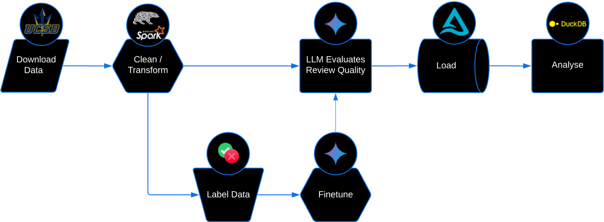

# One Star Reviews

Should you trust negative reviews more than positive ones? Some people think
[one-star reviews](https://near.blog/read-the-one-star-reviews/) are more
valuable, arguing that the frustration of a defective product motivates more
detailed feedback than satisfaction with a good one. But is this actually true?
This project uses machine learning and statistical analysis to investigate this
question empirically.

# The Process

The analysis pipeline consisted of four main stages:

1. **Data Collection**: Used the
   [2023 Amazon Reviews Dataset](https://amazon-reviews-2023.github.io/)
   containing ~250GB (uncompressed) of review and product data.

2. **Data Processing:** Developed two separate data processing pipelines
   tailored to the environment:

   - **Apache Spark:** Built a distributed pipeline as part of a learning
     initiative to understand its scalability for handling large datasets, even
     though the setup was on a single machine.
   - **Polars:** Created a separate single-node pipeline to optimize performance
     for local processing, significantly reducing runtime for the same tasks.

3. **Review Quality Assessment**:

   - Manually labeled 1,020 reviews (102 sets of 10) to create training data
   - Evaluated reviews on three criteria:

     - Information detail and usefulness
     - Objectivity and lack of emotional bias
     - Product-specific relevance

   - Fine-tuned Gemini 1.5 Flash on this labeled dataset
   - Validated model outputs through manual inspection of score distributions
     and edge cases

4. **Analysis and Visulization**: Used PowerBI to analyze relationships between
   review quality and various review/product characteristics.

# PowerBI Dashboard

To conveniently view the dashboard design, use the PDF link. To view the
dashboard with interactivity, click the "Download .pbix File" link, press the
"Download" button, then open this file in PowerBI desktop.

[View Dashboard PDF](../media/one-star-reviews.pdf)

[Download .pbix File](https://www.dropbox.com/scl/fi/omwsoelh6q57ut1kmm8dx/one-star-reviews.pbix?rlkey=pp09wg37vu2iblrgsgc1lnt72&st=4w871h8x&dl=0)

NOTE: Unfortunately, I cannot share this dashboard via a web link, as doing
so requires an organizational email address.
